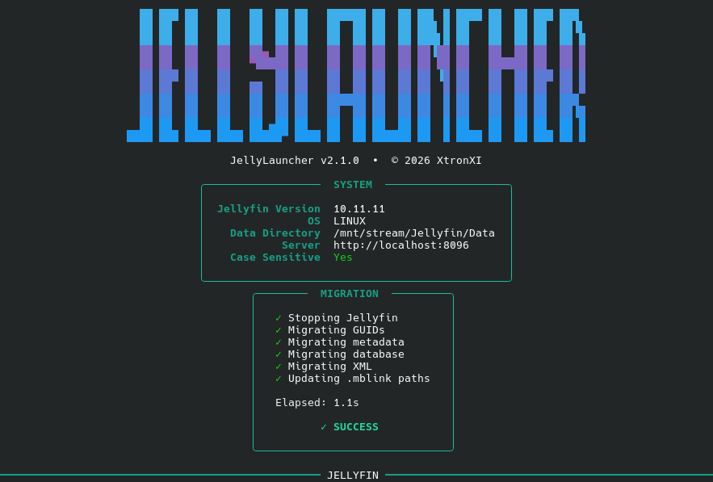

<h1 align="center">JellyLauncher</h1>

<p align="center">
<a href="https://github.com/XtronXI/jellylauncher/releases"></a>
<a href="https://github.com/XtronXI/jellylauncher"></a>
<a href="https://github.com/XtronXI/jellylauncher/blob/main/LICENSE"></a>
</p>

JellyLauncher is a launcher for the [Jellyfin](https://jellyfin.org) media server, designed for **dual-boot systems**. It lets a single Jellyfin instance, its database, and its metadata be shared between **Linux** and **Windows**. Every time you boot into the other operating system, JellyLauncher automatically migrates Jellyfin's on-disk state so both OSes keep working against the same data with no re-scanning, re-linking, or loss of watch history.



## Why a launcher?

Jellyfin computes an item's ID (GUID) by hashing its **item type + absolute filesystem path**. Because media lives at different paths on each OS (for example `/path/to/media/Movies` on Linux vs `C:\Path\To\Media\Movies` on Windows), **every item's GUID changes whenever you switch operating systems**. A plain shared data folder is therefore not enough — without intervention:

- every reference to an item ID in the database breaks (watch state, playlists, favorites, collections),
- on-disk metadata folders end up under GUID names that no longer match the database,
- embedded paths in the database, XML configuration, and `.mblink` link files all point at the other OS's paths.

JellyLauncher fixes all of this automatically, and only when it is actually needed.

## Usage

> [!WARNING]
> Migrating a library modifies the database, metadata folders, XML files, and link files. Although the migration is designed to be idempotent and reversible by simply booting the other OS again, **take a full backup of your data directory before your first run**. Keep at least one known-good backup (e.g. the copy produced by the OS that set the library up) so you can always restore.

### Share the same data directory (manual setup)

Both operating systems must point at the **same physical data directory**. This is a manual, one-time setup — the launcher does not create or move your data:

- Put the Jellyfin data directory on a partition or drive that both OSes can read/write (NTFS is the usual choice on a dual-boot machine).
- Install Jellyfin on **both** operating systems.
- Point each OS's Jellyfin install at the shared data directory (via `--datadir` in the start-up command or the service configuration).
- Make sure the media library paths are reachable from both OSes and set up so that each OS sees them at equivalent locations.
- Start Jellyfin in either one of the systems, and ensure the other **hasn't been started, ever**.

The launcher must know the **corresponding paths on the other OS** — this mapping is configured in `config.json` (see [Configuration](#configuration)). If a path has no counterpart on the other OS, it is left untouched.

### Installation

1. Clone or copy the project to a location reachable from both OSes.
2. Install the dependencies:

- **Python 3** on both operating systems.
- The Python packages listed in `requirements.txt` (`requests`, `rich`, `readchar`). Install them with:
  ```
  pip install -r requirements.txt
  ```
- **Linux**: Jellyfin's `jellyfin` executable available at the path from the config.
- **Windows**: Jellyfin's `jellyfin.exe` available at the path from the config.
3. Rename `config.example.json` to `config.json` and fill in your values (see [Configuration](#configuration)).

> [!NOTE]
> Only **Linux** and **Windows** are supported. macOS is not currently supported but may be added in a future release. Custom launchers, container orchestrators (e.g. Kubernetes), and other external service managers are not supported — the launcher expects to manage Jellyfin directly via `systemctl` or by spawning the executable.

### Configuration

Rename `config.example.json` to `config.json` and fill in your values. It has four parts:

| Key | Purpose |
| --- | --- |
| `server_url` | Jellyfin's HTTP API address (e.g. `http://localhost:8096`) |
| `api_key` | An API key (used to detect when the server is running) |
| `linux` / `windows` | Per-OS settings: `data_dir`, `server_executable`, `runtime`, and optional `service`/`container` fields (see below) |
| `paths` | Maps each path on the other OS to its equivalent on the current OS (see below) |

The `runtime` field controls how the launcher starts and stops Jellyfin. **`manual` (default) is recommended** for most setups:

| Value | Description |
| --- | --- |
| `manual` | The launcher manages Jellyfin directly — `systemctl` on Linux, spawns the executable on Windows. |
| `process` | Spawns `jellyfin.exe` directly on both OSes. |
| `service` | Manages Jellyfin as a system service. On Linux, requires `sudo` and a systemd unit; on Windows, use the **service name** (not the display name). |
| `container` | Manages Jellyfin as a container. Requires `container` (name) and `container_engine` (e.g. `docker`) to be set in your OS config. |

The `paths` mapping is the core of the migration. Each entry translates a path as it exists on the other OS into the equivalent path on the current OS. Paths with no counterpart on the other OS are left untouched.

### Running

Start the launcher from the project directory:

```
python launcher.py
```

The launcher will:

1. show the current system status (Jellyfin version, OS, data directory, case-sensitivity),
2. stop Jellyfin if it is running,
3. run the migration passes (only if the data directory exists),
4. start Jellyfin and stream its live logs.

Press `S` to stop Jellyfin and exit cleanly.

| Command | Description |
| --- | --- |
| `python launcher.py` | Migrate (if needed) and start Jellyfin |
| `python launcher.py --stop` | Stop Jellyfin and exit |
| `python launcher.py --verbose` | Show per-file migration details |

## How the migration works

Before starting the server, JellyLauncher stops Jellyfin (if running) and runs five migration passes in this order:

1. **Migrating GUIDs** — Recomputes every item ID whose path differs between the two OSes, building an `old → new` GUID mapping. Every reference to those IDs is then rewritten across the entire database using a collision-safe two-phase rename, and `PresentationUniqueKey` / `SeriesPresentationUniqueKey` values are recalculated for affected items.
2. **Migrating metadata** — Repairs stored metadata paths so they always point at the active `library` tree with a consistent `{prefix}/{guid}` folder layout, then physically renames and relocates metadata folders from their old-GUID names to their new-GUID names (searching both the active tree and the parked `linux_library` / `windows_library` trees).
3. **Migrating database** — Translates every absolute path stored in any `TEXT` column of any table, including all paths embedded inside `BaseItems.Data` JSON blobs.
4. **Migrating XML** — Rewrites paths in every XML file under the data directory (excluding `plugins/`) and removes duplicate `<PathInfos>` entries.
5. **Updating .mblink paths** — Rewrites the path stored in every `.mblink` link file.

### Pass details

**GUIDs** — For every item with a stored path, the path is translated to the current OS's form. If it changes, the ID is recomputed using Jellyfin's own ID algorithm (`md5(type + path)` over UTF-16LE, honoring `EnableCaseSensitiveItemIds`). Internal items whose IDs are derived from data-dir-relative keys (root folders, `CollectionFolder`, `Person`/`Genre`/`Studio`) are stable and are skipped. The mapping is then applied to every GUID reference in the database — including comma-separated lists such as `ExtraIds` and GUIDs nested in JSON — preserving each token's original dash style and case. `BaseItems.Id` is rewritten through a `PARK:` staging step so that swaps (e.g. `A → B` and `B → C`) cannot collide. Finally, `PresentationUniqueKey` and `SeriesPresentationUniqueKey` are recalculated for changed items (Seasons use `{seriesKey}-{IndexNumber:000}`); stable name-based keys are left as-is.

**Metadata paths** — Every `TEXT` cell containing a metadata path is normalized so it references the active `library` tree with a `{prefix}/{guid}` layout whose two-character prefix matches the GUID itself. This repairs the stale prefixes a GUID rewrite can otherwise leave behind. The corresponding on-disk folders are then located (under old-GUID names in the active tree or in the parked `linux_library` / `windows_library` trees) and moved into place under their new-GUID names.

**Database paths** — Every absolute path in every `TEXT` column is translated to the current OS's form. `BaseItems.Data` JSON blobs are walked recursively so paths nested anywhere inside them are translated too.

**XML** — Every XML file under the data directory (except `plugins/`) has its text content scanned for translatable paths, and duplicate `<PathInfos>` entries are removed.

**`.mblink` files** — The stored link target of every `.mblink` file is rewritten to the current OS's path.

### Idempotent by design

Each pass is idempotent. When the paths already match the current OS (for example, booting the OS that last wrote the data), the translations produce no changes and the migration completes almost instantly. You can run it repeatedly with no side effects.

The migration runs only when the configured data directory exists. If it doesn't, the launcher skips it and reports so.

## License

This project is licensed under the **MIT License**.

This project is an independent launcher and is not affiliated with the Jellyfin project. Jellyfin is a trademark of the Jellyfin project.
